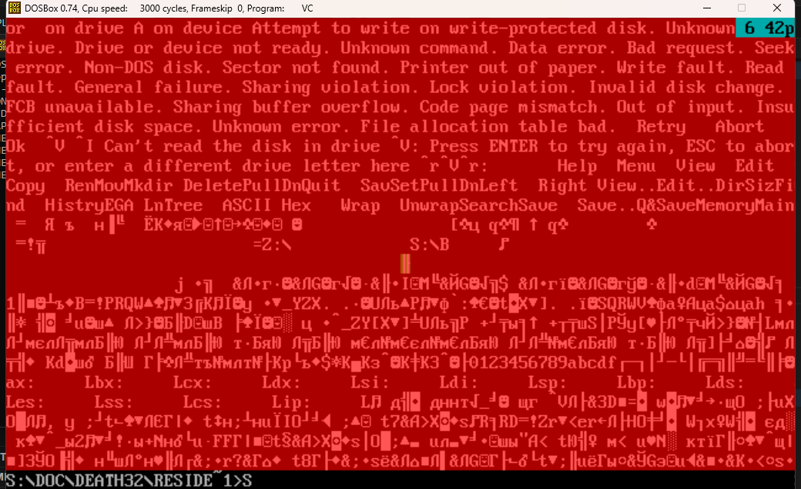

# Регистры в рамке

## Вывод текущего состояния регистров и флагов в рамке

### Описание
Эта программа перезаписывает функции обработчиков компьютерного и клавиатурного прерываний на вывод и постоянное обновление текущего состояния регистров и флагов в красивой рамке

```asm
mov ax, cx
```

**bold**
*bold*
***bold***



1. a
2. b