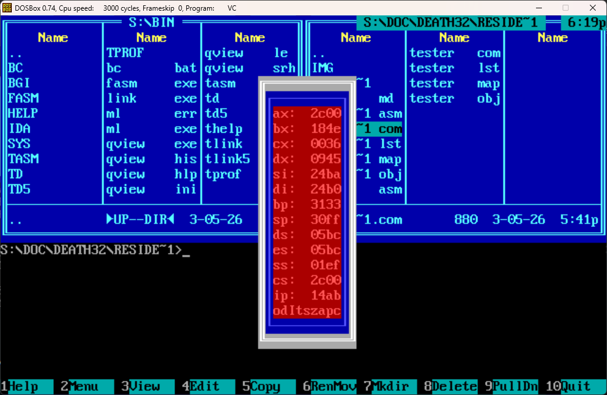

# Регистры в рамке

## Всалывающее окно dosbox с регистрами и флагами

### Описание
Эта программа выводит во всплывающем окне и постоянно обновление текущее состояние регистров и флагов в красивой рамке с патриотичными цветами в системе MS-DOS. Программа использует механизм TSR.



### Как скачать, собрать, запустить
1. Установите Turbo Assembler и Turbo Linker для вашего MS-DOS
2. Клонируйте этот репозиторий на свой компьютер
3. Скомпилируйте и запустите
```asm
tasm RESIDENT_PROG.ASM
tlink /t RESIDE~1.OBJ
RESIDE~1.COM
```

### Использование
Нажмите ` tilda ` для вывода окна и ` Ctrl ` + ` tilda ` для его скрытия. Флаги выводятся в соответствии с первыми буквами их названий.